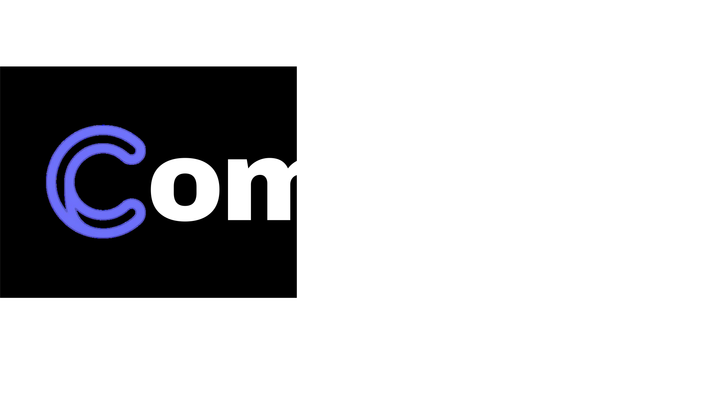
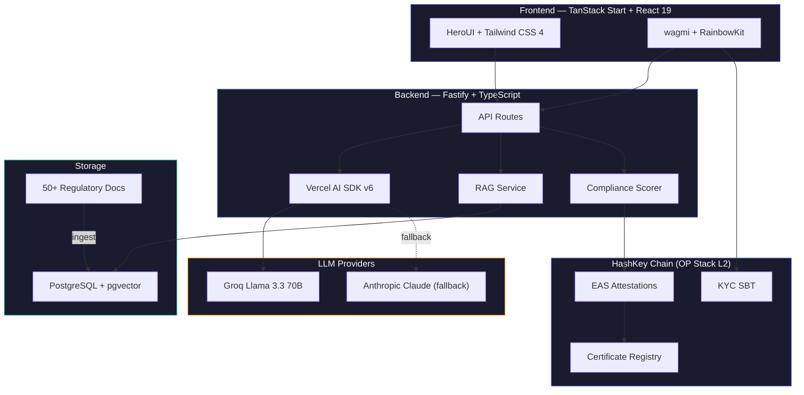
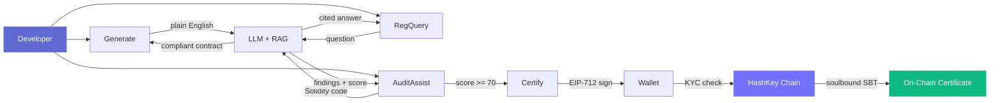
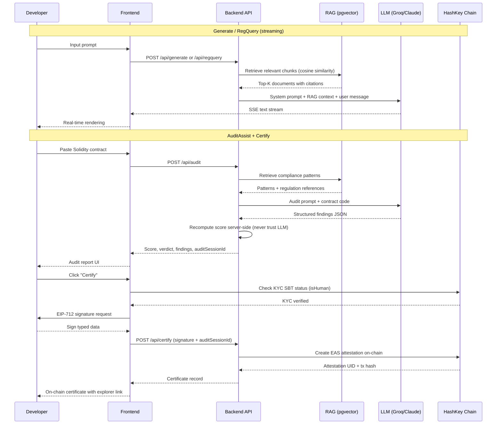

<p align="center">
  
</p>

<h1 align="center">CompliBot</h1>

<p align="center">
  <strong>AI Compliance Copilot for DeFi on HashKey Chain</strong>
</p>

<p align="center">
  <em>Generate compliant contracts. Ask regulatory questions. Audit Solidity. Prove compliance on-chain.</em>
</p>

<p align="center">
  <a href="#quick-start">Quick Start</a> &nbsp;&middot;&nbsp;
  <a href="#capabilities">Capabilities</a> &nbsp;&middot;&nbsp;
  <a href="#architecture">Architecture</a> &nbsp;&middot;&nbsp;
  <a href="#how-it-works">How It Works</a> &nbsp;&middot;&nbsp;
  <a href="#api-endpoints">API</a> &nbsp;&middot;&nbsp;
  <a href="#smart-contracts">Contracts</a>
</p>

<br />

<p align="center">
  
  
  
  
  
  
  
  
  
  
</p>

<p align="center">
  
  
  
  
  
</p>

---

## The Problem

Smart contracts and regulations speak different languages. Developers write Solidity; compliance teams write legal memos. Nobody translates between the two.

- A professional compliance audit costs **$30,000+** and takes **weeks**
- **72%** of DeFi exploits in 2024 came from smart contract vulnerabilities
- There is **no on-chain way** to prove a contract was reviewed for compliance

CompliBot is the missing infrastructure layer between _"I wrote a contract"_ and _"I can prove it is compliant."_

---

## Capabilities

<table>
  <tr>
    <td width="25%" align="center">
      <br />
      
      <h3>Generate</h3>
      <code>/generate</code>
      <br /><br />
      Describe what you need in plain English. Get a deployment-ready Solidity contract with KYC gates, access control, reentrancy protection, and compliance events built in.
      <br /><br />
    </td>
    <td width="25%" align="center">
      <br />
      
      <h3>RegQuery</h3>
      <code>/chat</code>
      <br /><br />
      Chat with CompliBot about any regulation. Get answers grounded in 50+ indexed documents (HK SFC, FATF, MiCA, HashKey) with full citations.
      <br /><br />
    </td>
    <td width="25%" align="center">
      <br />
      
      <h3>AuditAssist</h3>
      <code>/audit</code>
      <br /><br />
      Paste a contract. Get findings by severity, affected lines, code diff fixes, and the regulation each finding violates. Scored 0 to 100.
      <br /><br />
    </td>
    <td width="25%" align="center">
      <br />
      
      <h3>Certificate</h3>
      <code>/cert</code>
      <br /><br />
      Pass the audit, connect your wallet, sign. Receive a soulbound EAS attestation on HashKey Chain, verifiable by any protocol on-chain.
      <br /><br />
    </td>
  </tr>
</table>

---

## Architecture

### System Overview



### User Flow



### Data Flow



---

## How It Works

### RAG Pipeline

CompliBot uses **Retrieval-Augmented Generation** to ground every answer in real regulatory documents:

1. **Ingestion** (`bun run ingest`): Markdown and Solidity files from `backend/knowledge/` are chunked, embedded via Google Gemini (`gemini-embedding-001`, 768 dimensions), and stored in PostgreSQL with the `pgvector` extension.

2. **Retrieval**: On each request, the user's query is embedded and compared against stored chunks using cosine similarity (`<=>` operator). Top-K results (default 5, threshold 0.7) are returned with source metadata.

3. **Generation**: Retrieved chunks are injected into the system prompt alongside task-specific instructions. The LLM sees the regulation text, not just a summary.

| Component | Detail |
|:----------|:-------|
| Embedding model | `gemini-embedding-001` (768 dimensions) |
| Vector store | PostgreSQL + pgvector |
| Similarity metric | Cosine distance |
| Default top-K | 5 |
| Min similarity | 0.7 |
| Categories | `regulation`, `pattern`, `template`, `hashkey` |

### Compliance Scoring

The audit score is **always recomputed server-side** from parsed findings. The LLM's self-reported score is discarded to prevent prompt injection from inflating a contract's compliance rating.

```
Score = 100 - (critical x 25 + high x 15 + medium x 5 + low x 2)
```

| Verdict | Condition |
|:--------|:----------|
| **PASS** | Score >= 70, zero critical findings |
| **CONDITIONAL** | Score >= 70, but has high findings |
| **FAIL** | Score < 70, or any critical findings |

### On-Chain Certification

Certificates are **soulbound EAS attestations** on HashKey Chain (OP Stack L2):

1. Developer must hold a **KYC SBT** (verified via `IHashKeyKYC.isHuman()`)
2. Developer signs an **EIP-712 typed data** payload containing the audit hash, score, and findings summary
3. Backend verifies the signature, then submits an **EAS attestation** via the `CompliBotEAS` adapter contract
4. The attestation is non-transferable and linked to the developer's address
5. Any protocol can verify compliance by calling `isContractCertified()` on the `ComplianceCertificateRegistry`

---

## Tech Stack

| Layer | Technology | Purpose |
|:------|:-----------|:--------|
| **Runtime** | Bun | Package manager, test runner, script executor |
| **Frontend** | TanStack Start, React 19, Vite 7 | SSR-capable meta-framework with file-based routing |
| **UI** | HeroUI, Tailwind CSS 4, Framer Motion, Lucide | Component library, styling, animations, icons |
| **Wallet** | wagmi, viem, RainbowKit | Wallet connection, contract reads, tx signing |
| **Backend** | Fastify 5, Prisma 7 | HTTP server with rate limiting, ORM |
| **AI** | Vercel AI SDK v6, Groq, Anthropic | LLM orchestration with streaming and fallback |
| **RAG** | pgvector, Google Gemini embeddings | Vector similarity search over regulatory corpus |
| **Database** | PostgreSQL 15+ | Audit sessions, certificates, chat history, embeddings |
| **Chain** | HashKey Chain (OP Stack L2) | EAS attestations, KYC SBT verification |
| **Contracts** | Solidity 0.8.24, OpenZeppelin v5, Foundry | On-chain certificate registry and EAS adapter |

---

## Project Structure

```
complibot/
 |
 |- web/                        Frontend application
 |   |- src/
 |   |   |- routes/             File-based routing
 |   |   |   |- __root.tsx      Root layout (providers, header, footer)
 |   |   |   |- index.tsx       Landing page
 |   |   |   |- chat/           RegQuery chat interface
 |   |   |   |- audit/          AuditAssist split-pane
 |   |   |   |- cert/           Certificate viewer
 |   |   |   |- generate/       Contract generator
 |   |   |   +- dashboard/      Developer dashboard
 |   |   |- components/         Shared UI (ScoreGauge, CodeSnippet, etc.)
 |   |   |- lib/
 |   |   |   |- api/            API clients (audit, certify, generate)
 |   |   |   |- contracts/      ABIs for on-chain reads
 |   |   |   +- wagmi.ts        Chain + wallet config
 |   |   |- providers/          React context (HeroUI, Lenis, Theme, Web3)
 |   |   |- hooks/              useLocalStorage, etc.
 |   |   +- utils/              cnm(), motion constants
 |   +- public/                 Static assets, manifest, logo
 |
 |- backend/                    API server
 |   |- src/
 |   |   |- routes/             8 route files (generate, regquery, audit, certify, etc.)
 |   |   |- services/           Core business logic
 |   |   |   |- rag.ts          Vector search via pgvector
 |   |   |   |- llm.ts          LLM streaming with Groq/Claude fallback
 |   |   |   |- chain.ts        HashKey Chain interactions (KYC, EAS)
 |   |   |   |- compliance.ts   Score calculation + verdict logic
 |   |   |   +- auditParser.ts  Structured JSON extraction from LLM output
 |   |   |- prompts/            System prompt builders per capability
 |   |   |- shared/             Zod schemas, TypeScript types, constants
 |   |   +- lib/                Prisma client, AI providers, viem clients, embeddings
 |   |- knowledge/              RAG corpus
 |   |   |- regulations/        HK SFC, FATF, MiCA documents
 |   |   |- hashkey/            HashKey Chain-specific docs
 |   |   |- patterns/           Solidity compliance patterns
 |   |   +- templates/          Compliant contract templates
 |   |- prisma/                 Schema + migrations (pgvector)
 |   +- scripts/                Ingestion + EAS schema registration
 |
 |- contract/                   Smart contracts (Foundry)
 |   |- src/
 |   |   |- ComplianceCertificateRegistry.sol
 |   |   |- CompliBotEAS.sol
 |   |   |- base/KYCGated.sol
 |   |   |- interfaces/         IEAS, IHashKeyKYC
 |   |   |- examples/           CompliantVault, NonCompliantVault
 |   |   +- mocks/              Test mocks
 |   |- test/                   Foundry tests (5 test files)
 |   +- script/                 Deploy.s.sol
 |
 +- packages/
     +- shared/                 Cross-project types
```

> Each subdirectory has its own README with detailed documentation:
> - [`web/README.md`](web/README.md) - Frontend architecture, components, routing
> - [`backend/README.md`](backend/README.md) - API reference, services, database schema
> - [`contract/README.md`](contract/README.md) - Smart contract architecture, deployment, security

---

## Quick Start

### Prerequisites

| Tool | Version | Link |
|:-----|:--------|:-----|
| Bun | 1.1+ | [bun.sh](https://bun.sh/) |
| PostgreSQL | 15+ with pgvector | [pgvector](https://github.com/pgvector/pgvector) |
| Foundry | latest | [book.getfoundry.sh](https://book.getfoundry.sh/) |

### 1. Clone and install

```bash
git clone https://github.com/your-org/complibot.git
cd complibot
```

```bash
cd backend && bun install
cd ../web && bun install
cd ../contract && forge install
```

### 2. Configure environment

```bash
cp backend/env.example.txt backend/.env
cp contract/env.example contract/.env
```

<details>
<summary><strong>Environment variables reference</strong></summary>

| Variable | Required | Description |
|:---------|:--------:|:------------|
| `GROQ_API_KEY` | Yes | Primary LLM provider (Groq) |
| `ANTHROPIC_API_KEY` | Yes | Fallback LLM provider (Claude) |
| `DATABASE_URL` | Yes | PostgreSQL connection string with pgvector |
| `GOOGLE_GENERATIVE_AI_API_KEY` | Yes | Gemini embeddings for RAG pipeline |
| `ATTESTER_PRIVATE_KEY` | Yes | EAS attestation signer private key |
| `KYC_CONTRACT_ADDRESS` | Yes | HashKey KYC SBT contract address |
| `RPC_URL` | No | HashKey Chain RPC (default: `https://testnet.hsk.xyz`) |
| `CORS_ORIGINS` | No | Allowed origins (default: `http://localhost:3200`) |
| `PORT` | No | Backend port (default: `3001`) |
| `CHAIN_ID` | No | `133` for testnet, `177` for mainnet |

</details>

### 3. Set up the database

```bash
cd backend
bun run db:push       # Push schema + generate Prisma client
bun run ingest        # Embed and index knowledge base into pgvector
```

### 4. Run

```bash
# Terminal 1: Backend API (port 3001)
cd backend && bun run dev

# Terminal 2: Frontend (port 3200)
cd web && bun run dev
```

Open [http://localhost:3200](http://localhost:3200)

---

## Smart Contracts

> Deployed on **HashKey Chain Testnet** (Chain ID `133`)

| Contract | Address | Purpose |
|:---------|:--------|:--------|
| ComplianceCertificateRegistry | [`0x47B3...546D`](https://testnet.hashkeyscan.io/address/0x47B320A4ED999989AE3065Be28B208f177a7546D) | On-chain certificate storage, KYC-gated issuance |
| CompliBotEAS | [`0xd8Ec...8dE9`](https://testnet.hashkeyscan.io/address/0xd8EcF5D6D77bF2852c5e9313F87f31cc99c38dE9) | EAS attestation adapter with schema management |
| KYC SBT (HashKey) | [`0xBbe3...56b6`](https://testnet.hashkeyscan.io/address/0xBbe362BB261657bbD7202EB623DDBe6ED6a156b6) | Soulbound identity verification |

**OP Stack predeploys (fixed addresses):**
| Contract | Address |
|:---------|:--------|
| EAS | `0x4200000000000000000000000000000000000021` |
| Schema Registry | `0x4200000000000000000000000000000000000020` |

See [`contract/README.md`](contract/README.md) for full contract documentation.

---

## API Endpoints

| Method | Path | Type | Description |
|:------:|:-----|:-----|:------------|
| `POST` | `/api/generate` | SSE stream | Generate a compliant Solidity contract from natural language |
| `POST` | `/api/regquery` | SSE stream | Ask a regulatory compliance question with RAG citations |
| `POST` | `/api/audit` | JSON | Audit a Solidity contract, return score + findings |
| `POST` | `/api/certify` | JSON | Issue an on-chain EAS compliance certificate |
| `GET` | `/api/certs/:address` | JSON | List all certificates for a wallet address |
| `GET` | `/api/certs/:address/:uid` | JSON | Get a specific certificate by attestation UID |
| `GET` | `/api/stats` | JSON | Platform statistics (certificates, audits, scores) |
| `GET` | `/api/health` | JSON | Health check |

See [`backend/README.md`](backend/README.md) for request/response schemas.

---

## Knowledge Base

CompliBot's RAG corpus includes **50+ documents** across six categories:

<table>
  <tr>
    <td align="center" width="33%">
      <strong>HK SFC</strong><br/>
      VATP Guidelines, AMLO,<br/>licensing requirements
    </td>
    <td align="center" width="33%">
      <strong>FATF</strong><br/>
      Travel Rule, Virtual Asset<br/>service provider guidance
    </td>
    <td align="center" width="33%">
      <strong>EU MiCA</strong><br/>
      Markets in Crypto-Assets<br/>regulation framework
    </td>
  </tr>
  <tr>
    <td align="center">
      <strong>HashKey Chain</strong><br/>
      KYC SBT integration,<br/>ecosystem documentation
    </td>
    <td align="center">
      <strong>OpenZeppelin</strong><br/>
      Security patterns,<br/>AccessControl, ReentrancyGuard
    </td>
    <td align="center">
      <strong>EIP Standards</strong><br/>
      EIP-712 typed data,<br/>EIP-4626 vaults, EAS
    </td>
  </tr>
</table>

Every answer includes citations back to the source document and section. No hallucinations.

---

## Commands

<details>
<summary><strong>Backend</strong></summary>

```bash
bun run dev              # Development server (watch mode, port 3001)
bun run start            # Production start
bun run typecheck        # TypeScript type checking
bun test                 # Run all tests (52 test cases)
bun run db:push          # Push Prisma schema + generate client
bun run db:generate      # Generate Prisma client only
bun run ingest           # Embed + index knowledge base into pgvector
bun run register-schema  # Register EAS compliance schema on-chain
```

</details>

<details>
<summary><strong>Frontend</strong></summary>

```bash
bun dev        # Dev server (port 3200, HMR)
bun build      # Production build (SSR via Nitro)
bun preview    # Preview production build
bun lint       # ESLint
bun format     # Prettier
bun check      # Format + lint fix
```

</details>

<details>
<summary><strong>Contracts</strong></summary>

```bash
forge build                      # Compile all contracts
forge test                       # Run all tests
forge test -vvv                  # Verbose test output
forge script script/Deploy.s.sol # Deploy to configured network
```

</details>

---

## Hackathon

<table>
  <tr>
    <td><strong>Event</strong></td>
    <td>HashKey Chain On-Chain Horizon Hackathon (Phase 2)</td>
  </tr>
  <tr>
    <td><strong>Track</strong></td>
    <td>AI / AI Agent</td>
  </tr>
  <tr>
    <td><strong>Prize Pool</strong></td>
    <td>40,000 USDT</td>
  </tr>
  <tr>
    <td><strong>Finals</strong></td>
    <td>April 22-23, 2026 | Hong Kong Web3 Festival</td>
  </tr>
</table>

---

<p align="center">
  
</p>

<p align="center">
  <strong>CompliBot</strong><br/>
  <em>Build compliant DeFi without a legal team.</em>
</p>

<p align="center">
  <sub>MIT License</sub>
</p>
