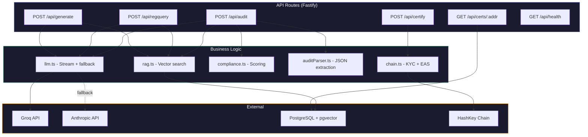
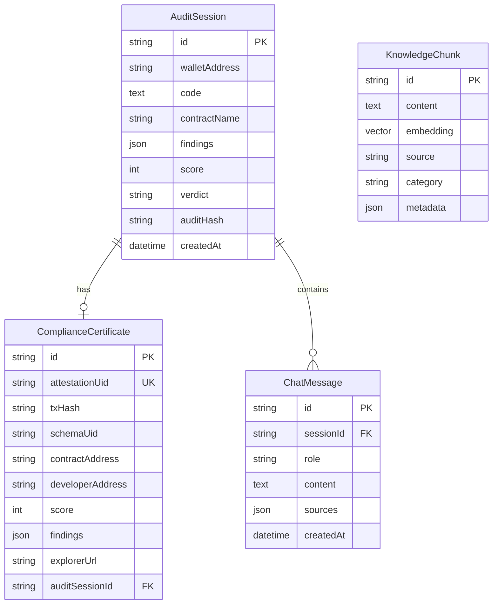

<h1 align="center">CompliBot Backend</h1>

<p align="center">
  <strong>Fastify API server powering CompliBot's AI compliance engine</strong>
</p>

<p align="center">
  
  
  
  
  
  
</p>

---

## Overview

The backend is a **Fastify 5** TypeScript API that orchestrates:

- **RAG retrieval** over 50+ regulatory documents via pgvector
- **LLM streaming** (Groq Llama 3.3 70B primary, Anthropic Claude fallback) via Vercel AI SDK v6
- **Compliance scoring** with server-side score recomputation (never trusts LLM output)
- **On-chain attestation** via EAS on HashKey Chain (OP Stack L2)
- **KYC verification** via HashKey's soulbound KYC SBT contract

---

## Commands

```bash
bun run dev              # Watch mode development server (port 3001)
bun run start            # Production start
bun run typecheck        # TypeScript type checking
bun test                 # Run all tests (52 test cases)
bun run db:push          # Push Prisma schema + generate client
bun run db:pull          # Pull schema from database
bun run db:generate      # Generate Prisma client only
bun run db:migrate       # Create and run migration
bun run ingest           # Embed + index knowledge base into pgvector
bun run register-schema  # Register EAS compliance schema on HashKey Chain
```

---

## Architecture



---

## Structure

```
backend/
 |- index.ts                    Entry point: Fastify setup, plugin registration, server start
 |- dotenv.ts                   Environment loader (dotenv/config)
 |
 |- src/
 |   |- config/
 |   |   +- main-config.ts      Centralized env config (all process.env reads here)
 |   |
 |   |- routes/                 API route handlers
 |   |   |- generate.ts         POST /api/generate (streaming contract generation)
 |   |   |- regquery.ts         POST /api/regquery (streaming regulatory Q&A)
 |   |   |- audit.ts            POST /api/audit (one-shot audit with DB persistence)
 |   |   |- certify.ts          POST /api/certify (on-chain EAS attestation)
 |   |   |- certificates.ts     GET /api/certs/:address, GET /api/certs/:address/:uid
 |   |   |- chat.ts             POST /api/chat (general chat, session-based)
 |   |   |- stats.ts            GET /api/stats (platform statistics)
 |   |   +- health.ts           GET /api/health
 |   |
 |   |- services/               Core business logic
 |   |   |- rag.ts              pgvector cosine similarity search, chunk formatting
 |   |   |- llm.ts              Groq primary + Claude fallback streaming
 |   |   |- chain.ts            KYC SBT verification, EAS attestation creation
 |   |   |- compliance.ts       Score calculation + verdict determination
 |   |   +- auditParser.ts      Extract structured JSON findings from LLM text
 |   |
 |   |- prompts/                System prompt builders
 |   |   |- generate.ts         Contract generation prompt with compliance patterns
 |   |   |- regquery.ts         Regulatory Q&A prompt with citation instructions
 |   |   +- audit.ts            Audit prompt with structured output format
 |   |
 |   |- shared/                 Cross-cutting types and validation
 |   |   |- types.ts            TypeScript interfaces (AuditFinding, Severity, etc.)
 |   |   |- schemas.ts          Zod validation schemas for all endpoints
 |   |   |- constants.ts        Contract addresses, chain IDs, EIP-712 types
 |   |   +- index.ts            Re-exports
 |   |
 |   |- lib/                    External integrations
 |   |   |- prisma.ts           Prisma client singleton
 |   |   |- providers.ts        AI SDK model instances (Groq, Anthropic)
 |   |   |- embeddings.ts       Google Gemini embedding config (768d)
 |   |   +- viem.ts             HashKey Chain public + wallet clients
 |   |
 |   +- utils/                  Low-level utilities
 |       |- errorHandler.ts     Standardized error responses
 |       |- validationUtils.ts  Input sanitization
 |       |- miscUtils.ts        General helpers
 |       +- timeUtils.ts        Timestamp formatting
 |
 |- knowledge/                  RAG knowledge base (source documents)
 |   |- regulations/            HK SFC, FATF Travel Rule, MiCA, AMLO
 |   |- hashkey/                HashKey Chain docs, KYC SBT, ecosystem
 |   |- patterns/               Solidity compliance patterns (KYC, limits, access)
 |   +- templates/              Compliant contract templates
 |
 |- prisma/
 |   |- schema.prisma           Database schema with pgvector
 |   |- prisma.config.ts        Prisma 7 defineConfig
 |   +- generated/              Generated Prisma client
 |
 |- scripts/
 |   |- ingest.ts               Knowledge base ingestion pipeline
 |   +- register-schema.ts      EAS schema registration on-chain
 |
 +- test/
     |- routes/                 Route handler tests (mocked dependencies)
     +- services/               Service logic unit tests
```

---

## API Reference

### `POST /api/generate`

Generate a compliant Solidity contract from natural language. **Streaming SSE response.**

```json
// Request
{
  "messages": [
    { "role": "user", "content": "Create an ERC-20 token with KYC gates and transaction limits" }
  ]
}

// Response: text/event-stream (raw text chunks)
```

### `POST /api/regquery`

Ask a regulatory compliance question. **Streaming SSE response.**

```json
// Request
{
  "messages": [
    { "role": "user", "content": "What KYC requirements does HashKey Chain enforce?" }
  ]
}

// Response: text/event-stream (raw text chunks with citations)
```

### `POST /api/audit`

Audit a Solidity contract for compliance. **JSON response** (one-shot, not streaming).

```json
// Request
{
  "contractCode": "// SPDX-License-Identifier: MIT\npragma solidity ^0.8.20;\n...",
  "contractName": "SimpleSwap",
  "walletAddress": "0x...",
  "messages": []
}

// Response
{
  "auditSessionId": "cm...",
  "score": 35,
  "verdict": "FAIL",
  "findingsSummary": { "critical": 1, "high": 2, "medium": 1, "low": 0 },
  "findings": [
    {
      "severity": "CRITICAL",
      "title": "No KYC verification",
      "description": "...",
      "location": { "function": "swap", "line": 15 },
      "fix": "Add onlyVerifiedHuman modifier",
      "regulation": "HK SFC VATP Guidelines 10.4"
    }
  ],
  "summary": {
    "compliance_score": 35,
    "verdict": "FAIL",
    "critical": 1, "high": 2, "medium": 1, "low": 0,
    "top_recommendation": "Add KYC verification to all public functions"
  },
  "createdAt": "2026-04-13T..."
}
```

### `POST /api/certify`

Issue an on-chain compliance certificate. Requires prior audit session and KYC verification.

```json
// Request
{
  "contractAddress": "0x...",
  "developerAddress": "0x...",
  "auditSessionId": "cm...",
  "signature": "0x...",
  "contractName": "SimpleSwap",
  "version": "1.0.0"
}

// Response
{
  "attestationUid": "0x...",
  "txHash": "0x...",
  "explorerUrl": "https://testnet.hashkeyscan.io/tx/0x...",
  "certificateId": "cm..."
}
```

### `GET /api/certs/:address`

List all compliance certificates for a wallet address.

### `GET /api/certs/:address/:uid`

Get a specific certificate by attestation UID.

### `GET /api/health`

```json
{ "status": "ok", "timestamp": "2026-04-13T..." }
```

---

## Database Schema

Four models managed by Prisma 7 with pgvector:



---

## Services

### `rag.ts` - Vector Search

```
Query -> Gemini Embedding (768d) -> pgvector cosine search -> Top-K chunks
```

- Uses `<=>` operator for cosine distance
- Filters by category (`regulation`, `pattern`, `template`, `hashkey`)
- Default: top 5 results, minimum 0.7 similarity

### `llm.ts` - LLM Streaming

- **Primary**: Groq Llama 3.3 70B (fast inference)
- **Fallback**: Anthropic Claude (higher quality, used on Groq errors)
- Both accessed through Vercel AI SDK v6 unified interface

### `compliance.ts` - Score Calculation

```
Score = 100 - (critical x 25 + high x 15 + medium x 5 + low x 2)
```

Verdicts:
- **PASS**: Score >= 70, zero critical findings
- **CONDITIONAL**: Score >= 70, but has high findings
- **FAIL**: Score < 70, or any critical findings

Score is **always recomputed server-side**. The LLM's self-reported score is discarded.

### `chain.ts` - On-Chain Integration

- **KYC check**: Reads `IHashKeyKYC.isHuman(address)` to verify soulbound identity
- **EAS attestation**: Creates non-transferable attestations via the `CompliBotEAS` adapter
- **Signature verification**: Validates EIP-712 typed data signatures

### `auditParser.ts` - LLM Output Parser

Extracts structured JSON from free-form LLM text:
1. Scans for balanced `{}` braces (handling string escapes)
2. Validates each candidate against Finding or Summary Zod schemas
3. Falls back to empty report with FAIL verdict on parse failure

---

## Knowledge Base

The `knowledge/` directory contains the RAG corpus:

| Directory | Content | Category |
|:----------|:--------|:---------|
| `regulations/` | HK SFC VATP, FATF Travel Rule, EU MiCA, AMLO | `regulation` |
| `hashkey/` | HashKey Chain docs, KYC SBT, ecosystem guides | `hashkey` |
| `patterns/` | Solidity compliance patterns (KYC, limits, reporting, access) | `pattern` |
| `templates/` | Compliant contract templates (vaults, tokens, swaps) | `template` |

**Ingestion pipeline** (`scripts/ingest.ts`):
1. Reads all `.md` and `.sol` files from `knowledge/`
2. Chunks by section headers (markdown) or contract boundaries (Solidity)
3. Embeds each chunk via Google Gemini (`gemini-embedding-001`, 768d)
4. Upserts into the `KnowledgeChunk` table with pgvector

---

## Configuration

All environment variables are centralized in `src/config/main-config.ts`. Import from config, never use `process.env` directly:

```ts
import { GROQ_API_KEY, DATABASE_URL, IS_DEV } from '@/config/main-config.ts';
```

<details>
<summary><strong>Full variable reference</strong></summary>

| Variable | Type | Default | Description |
|:---------|:-----|:--------|:------------|
| `PORT` | number | `3001` | Server port |
| `HOST` | string | `0.0.0.0` | Server host |
| `NODE_ENV` | string | `development` | Environment mode |
| `DATABASE_URL` | string | required | PostgreSQL connection string |
| `GROQ_API_KEY` | string | required | Groq LLM API key |
| `ANTHROPIC_API_KEY` | string | required | Anthropic fallback API key |
| `GOOGLE_GENERATIVE_AI_API_KEY` | string | required | Gemini embedding key |
| `ATTESTER_PRIVATE_KEY` | string | required | EAS attestation signer |
| `KYC_CONTRACT_ADDRESS` | string | required | HashKey KYC SBT address |
| `COMPLIBOT_SCHEMA_UID` | string | optional | Pre-registered EAS schema |
| `HASHKEY_CHAIN_ID` | string | `133` | Chain ID (133=testnet, 177=mainnet) |
| `CORS_ORIGINS` | string | `http://localhost:3200` | Comma-separated allowed origins |
| `KYC_BYPASS_FOR_TESTING` | boolean | `false` | Dev-only KYC bypass |
| `LOG_LEVEL` | string | `info` | Pino log level |

</details>

---

## Security

- **Input validation**: All request bodies validated with Zod schemas at the route boundary
- **Rate limiting**: Global 100 req/min, per-route limits on LLM endpoints (10 req/min)
- **CORS**: Explicit origin allowlist, no wildcard
- **Score integrity**: Compliance scores always recomputed server-side from parsed findings
- **Error sanitization**: Internal errors never exposed to clients (generic 500 messages)
- **Parameterized queries**: All database operations through Prisma (no raw SQL interpolation)
- **Secret isolation**: All secrets in `main-config.ts`, never logged or returned in responses

---

## Testing

```bash
bun test                           # All 52 tests
bun test test/routes/audit.test.ts # Single file
bun test test/services/            # Directory
```

Tests use `bun:test` with module-level mocking. Route tests mock Prisma, AI SDK, and viem before importing handlers.
