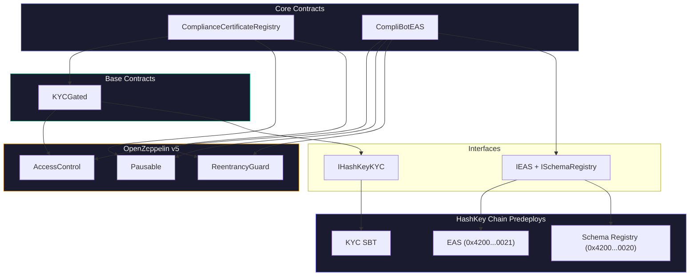

<h1 align="center">CompliBot Smart Contracts</h1>

<p align="center">
  <strong>On-chain compliance certification for HashKey Chain</strong>
</p>

<p align="center">
  
  
  
  
  
</p>

---

## Overview

Two core contracts that bring CompliBot's compliance pipeline on-chain:

1. **`ComplianceCertificateRegistry`**: Stores compliance certificates, enforces KYC gates, manages issuance and revocation
2. **`CompliBotEAS`**: Adapter for the Ethereum Attestation Service (EAS) predeploy on HashKey Chain's OP Stack L2

Both contracts integrate with HashKey's **KYC SBT** (soulbound token) to ensure only verified humans can receive compliance certificates.

---

## Commands

```bash
forge build                                    # Compile all contracts
forge test                                     # Run all tests
forge test -vvv                                # Verbose output with traces
forge test --match-test testRevertNoKYC        # Run specific test
forge script script/Deploy.s.sol               # Dry-run deploy
forge script script/Deploy.s.sol --broadcast   # Deploy to network
```

---

## Deployed Contracts

> **HashKey Chain Testnet** (Chain ID `133`)

| Contract | Address | Verified |
|:---------|:--------|:--------:|
| ComplianceCertificateRegistry | [`0x47B320A4ED999989AE3065Be28B208f177a7546D`](https://testnet.hashkeyscan.io/address/0x47B320A4ED999989AE3065Be28B208f177a7546D) | Yes |
| CompliBotEAS | [`0xd8EcF5D6D77bF2852c5e9313F87f31cc99c38dE9`](https://testnet.hashkeyscan.io/address/0xd8EcF5D6D77bF2852c5e9313F87f31cc99c38dE9) | Yes |
| KYC SBT (HashKey-deployed) | [`0xBbe362BB261657bbD7202EB623DDBe6ED6a156b6`](https://testnet.hashkeyscan.io/address/0xBbe362BB261657bbD7202EB623DDBe6ED6a156b6) | N/A |

**OP Stack predeploys (fixed addresses on all OP chains):**

| Contract | Address |
|:---------|:--------|
| EAS | `0x4200000000000000000000000000000000000021` |
| Schema Registry | `0x4200000000000000000000000000000000000020` |

---

## Contract Architecture



---

## Structure

```
src/
 |- ComplianceCertificateRegistry.sol    Main certificate storage contract
 |- CompliBotEAS.sol                     EAS attestation adapter
 |
 |- base/
 |   +- KYCGated.sol                    Abstract base with KYC modifiers
 |
 |- interfaces/
 |   |- IHashKeyKYC.sol                 HashKey KYC SBT interface
 |   +- IEAS.sol                        EAS + SchemaRegistry interfaces
 |
 |- examples/
 |   |- CompliantVault.sol              Example: fully compliant ERC-4626 vault
 |   +- NonCompliantVault.sol           Example: vault with compliance violations
 |
 +- mocks/                              Test mock contracts

test/
 |- ComplianceCertificateRegistry.t.sol  Registry tests
 |- CompliBotEAS.t.sol                   EAS adapter tests
 |- CompliantVault.t.sol                 Example vault tests
 |- Exploits.t.sol                       Attack vector tests
 +- MockKYCSBT.t.sol                     KYC mock tests

script/
 +- Deploy.s.sol                         Deployment script
```

---

## Contract Details

### `ComplianceCertificateRegistry`

The main on-chain storage for compliance certificates. KYC-gated via `KYCGated` base contract.

**Key features:**
- Certificate issuance with minimum score enforcement (default: 70)
- Certificate revocation by admin
- Lookup by developer address, contract address, or certificate ID
- `isContractCertified(address)` for composable verification
- KYC verification on all state-changing operations

**Certificate struct:**

| Field | Type | Description |
|:------|:-----|:------------|
| `id` | `bytes32` | Unique certificate ID |
| `contractAddress` | `address` | Audited contract |
| `developer` | `address` | Certificate holder |
| `complianceScore` | `uint8` | 0-100 score |
| `auditHash` | `bytes32` | keccak256 of audit data |
| `criticalFindings` | `uint8` | Count by severity |
| `highFindings` | `uint8` | |
| `mediumFindings` | `uint8` | |
| `lowFindings` | `uint8` | |
| `issuedAt` | `uint256` | Block timestamp |
| `revoked` | `bool` | Revocation status |
| `version` | `string` | Schema version |

**Roles:**
- `DEFAULT_ADMIN_ROLE`: Can set KYC contract, pause/unpause, update minimum score
- `ATTESTER_ROLE`: Can issue and revoke certificates

### `CompliBotEAS`

Adapter contract for creating EAS attestations on HashKey Chain.

**Key features:**
- Schema registration on the OP Stack Schema Registry predeploy
- Non-transferable (soulbound) attestation creation
- Attestation revocation
- Duplicate prevention (one attestation per certificate ID)

**EAS Schema:**
```
address contractAddress, address developerAddress, uint8 complianceScore,
bytes32 auditHash, string version, uint8 criticalFindings, uint8 highFindings,
uint8 mediumFindings, uint8 lowFindings
```

### `KYCGated` (base)

Abstract contract providing KYC verification modifiers:

```solidity
modifier onlyVerifiedHuman()           // Requires valid KYC SBT
modifier onlyMinKycLevel(uint8 level)  // Requires minimum KYC level
```

Reads from HashKey's `IHashKeyKYC.isHuman(address)` which returns `(bool isValid, uint8 level)`.

---

## Security

| Pattern | Implementation |
|:--------|:---------------|
| **Access Control** | OpenZeppelin `AccessControl` with `ATTESTER_ROLE` and `DEFAULT_ADMIN_ROLE` |
| **Reentrancy** | `ReentrancyGuard` on all state-changing functions |
| **Pausable** | Emergency pause capability on both contracts |
| **KYC Gate** | Soulbound identity verification via HashKey KYC SBT |
| **Custom Errors** | Gas-efficient error handling (no revert strings) |
| **Events** | All state changes emit events for indexing |
| **Input Validation** | Zero-address checks, score range validation, duplicate prevention |
| **Checks-Effects-Interactions** | State changes before external calls |

---

## Example Contracts

### `CompliantVault.sol`

A fully compliant ERC-4626 vault demonstrating all required patterns:
- KYC gate on deposits and withdrawals
- Transaction limits
- Reentrancy protection
- Access control
- Event emission for compliance reporting

### `NonCompliantVault.sol`

The same vault **without** compliance patterns. Used by CompliBot's audit demo to show what findings look like when compliance is missing.

---

## Configuration

### `foundry.toml`

```toml
[profile.default]
solc = "0.8.24"
optimizer = true
optimizer_runs = 200

[rpc_endpoints]
hashkeyTestnet = "https://testnet.hsk.xyz"
hashkeyMainnet = "https://mainnet.hsk.xyz"
```

### Environment (`.env`)

```bash
PRIVATE_KEY=0x...           # Deployer private key
ETHERSCAN_API_KEY=...       # For contract verification
KYC_CONTRACT_ADDRESS=0x...  # HashKey KYC SBT contract
```

---

## Deployment

```bash
# 1. Configure .env
cp env.example .env

# 2. Build
forge build

# 3. Run tests
forge test

# 4. Deploy to HashKey Chain Testnet
forge script script/Deploy.s.sol \
  --rpc-url hashkeyTestnet \
  --broadcast \
  --verify

# 5. Verify (if not auto-verified)
forge verify-contract <ADDRESS> src/ComplianceCertificateRegistry.sol:ComplianceCertificateRegistry \
  --chain 133 \
  --etherscan-api-key $ETHERSCAN_API_KEY
```

---

## Integration

Any protocol on HashKey Chain can verify a contract's compliance status:

```solidity
import {ComplianceCertificateRegistry} from "./ComplianceCertificateRegistry.sol";

contract MyProtocol {
    ComplianceCertificateRegistry public registry;

    modifier onlyCertified(address contractAddr) {
        require(
            registry.isContractCertified(contractAddr),
            "Contract not certified"
        );
        _;
    }

    function addPool(address token) external onlyCertified(token) {
        // Only certified contracts can be added
    }
}
```
